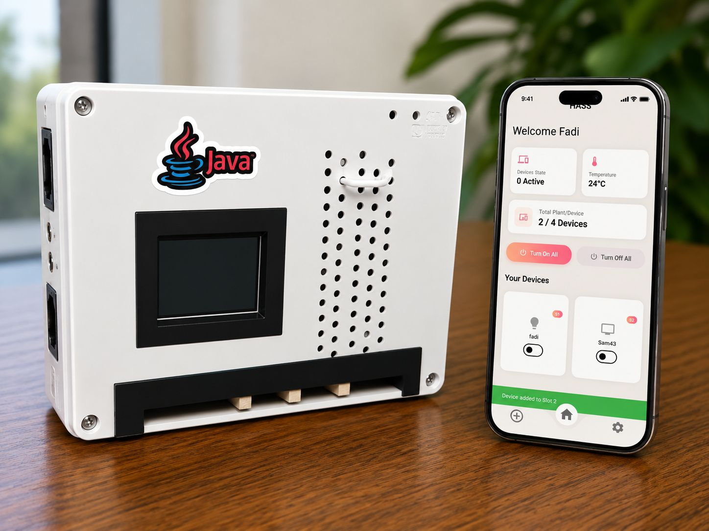
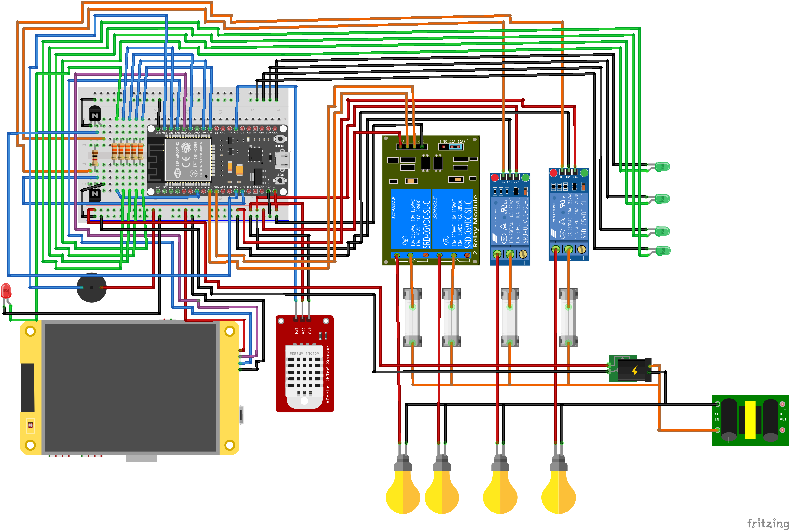

# 🏠 HASS – Home Automation Smart System

> A privacy-first, ESP32-based smart home automation system for controlling high-power and low-power home appliances remotely using a mobile application and local smart display.



---

## 📌 Overview

**HASS (Home Automation Smart System)** is an IoT-based smart home solution designed to transform traditional homes into intelligent, energy-efficient, and secure environments.

The system enables users to remotely control electrical devices such as:

- 💡 Lights  
- ❄️ Air Conditioners  
- 🖥️ Home Appliances  
- 🌡️ Environmental Monitoring

through a **mobile application**, **smart TFT display**, and **ESP32 controller**.

Unlike many commercial smart home systems, **HASS is privacy-focused and operates locally without cloud dependency**, ensuring security and fast response time.

---

## 🚀 Features

### ✅ Smart Device Control
- Remote ON/OFF control for appliances
- Real-time device monitoring
- Multi-device management in one interface

### 🌡️ Environmental Monitoring
- Temperature monitoring
- Humidity monitoring
- Automatic actions based on sensor values

### ⚡ Energy Efficiency
- Device scheduling
- Automatic shutdown timers
- Smart energy management

### 🔒 Safety Features
- Dual fuse protection (**10A & 30A**)
- High-power relay support
- Electrical isolation through relay modules

### 📱 User Interfaces
- Flutter Mobile Application
- Local TFT Smart Display
- LED indicators
- Audio alerts via buzzer

### 🤖 Automation Rules
Example:

```txt
IF temperature > 30°C
THEN Turn ON Air Conditioner
```

```txt
IF time = 11:00 PM
THEN Turn OFF all devices
```

---

## 🛠️ Hardware Components

| Component | Purpose |
|------------|----------|
| ESP32 | Main microcontroller |
| TFT Display | Smart local control panel |
| DHT22 Sensor | Temperature & humidity |
| 10A Relay Module | Low-power appliances |
| 30A Relay Module | High-power appliances |
| LEDs | Status indicators |
| Buzzer | Audio feedback |
| Power Supply | AC to DC conversion |
| Fuse Protection | Electrical safety |

---

## 🔌 Hardware Connection Diagram



The system is powered by an **ESP32 microcontroller** connected to:

- TFT display via UART
- DHT22 temperature/humidity sensor
- 10A & 30A relays
- LEDs and buzzer for feedback
- High-power electrical loads

---

## 📲 Mobile Application

The HASS mobile application allows users to:

- Control home appliances remotely
- View temperature and humidity
- Monitor connected devices
- Turn all devices ON/OFF
- Receive live status updates


---

## 🏗️ System Architecture

The project follows a **3-layer architecture**:

```txt
User Layer
│
├── Mobile Application
└── TFT Smart Display

↓ Wi-Fi Communication

Control Layer
│
└── ESP32 Microcontroller

↓ GPIO Signals

Hardware Layer
│
├── Relay Modules
├── Sensors
└── Home Appliances
```

---

## ⚙️ GPIO Pin Mapping

| Function | GPIO |
|----------|------|
| UART RX | GPIO16 |
| UART TX | GPIO17 |
| Relay 1 | GPIO25 |
| Relay 2 | GPIO26 |
| Relay 3 | GPIO27 |
| Relay 4 | GPIO14 |
| Buzzer  | GPIO13 |
| DHT22   | GPIO32 |
| ETH_CS  | GPIO5  |
| Eth_RST | GPIO4  |
| Eth_Miso| GPIO19 |
| Eth_MOSI| GPIO23 |
| Eth_SCLK| GPIO18 |


---

## 🔥 Project Advantages

✅ Supports **high-power appliances up to 2.25 HP**

✅ **Privacy-first system**
- No tracking
- No unnecessary cloud dependency
- Local control

✅ **Fast response time**
- Average: **1.2–1.8 seconds**

✅ **Scalable architecture**
- Easily add new sensors/devices

✅ **Smart automation**
- IF–THEN rules
- Scheduling support

---

## 📊 Testing Results

| Test | Result |
|------|--------|
| Device Control | ✅ Pass |
| Response Time | ✅ Pass |
| Connectivity | ✅ Pass |
| User Interface | ✅ Pass |
| Automation | ✅ Pass |

### Performance
- Response time: **1.2 – 1.8 seconds**
- Stable Wi-Fi communication
- Reliable relay switching
- Real-time synchronization

---

## 🧠 Technologies Used

### Hardware
- ESP32
- DHT22
- TFT Display
- Relay Modules
- Buzzer
- LEDs

### Software
- Flutter
- Dart
- Firebase Realtime Database
- ESP32 Firmware
- IoT Communication

---

## 📈 Future Improvements

Planned future upgrades include:

- 🎤 Voice Assistant Integration (Alexa, Siri, Google Assistant)
- 🧠 AI-based Energy Optimization
- ☁️ Cloud Monitoring
- 🚨 Smoke & Motion Detection
- 🚪 Smart Door Lock Integration
- 🌞 Renewable Energy Monitoring
- 🎥 Security Cameras

---

## 👨‍💻 Team Members

| Name |
|------|
| Fadi Sobhy Nashed Sedrak |
| Rawan Saeed Mohammed |
| Julia Essam Maher Wasfy |
| Ahmed Abdelmaksoud Abdelaziz |
| Mohamed Ahmed Mohiy |
| Youssef Refaat Sadek Iskandar |
| Nour Eldeen Elhamy Wahby |

### Supervisor
**Dr. Amira Abdelmoneim**

---

## 📷 Project Prototype

A real prototype of the system including the hardware enclosure and mobile application.

---

## 📄 License

This project is developed for **academic and educational purposes**.

---

## ⭐ Support

If you like this project, don't forget to **star the repository** ⭐
